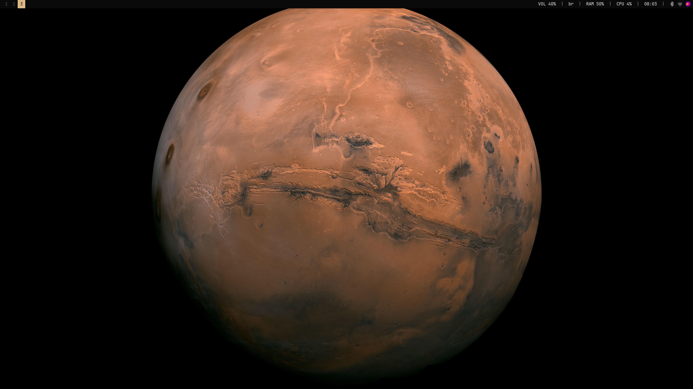
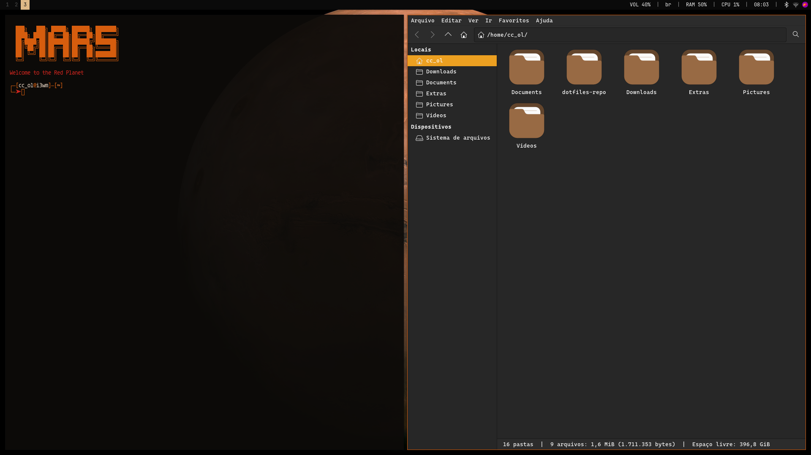
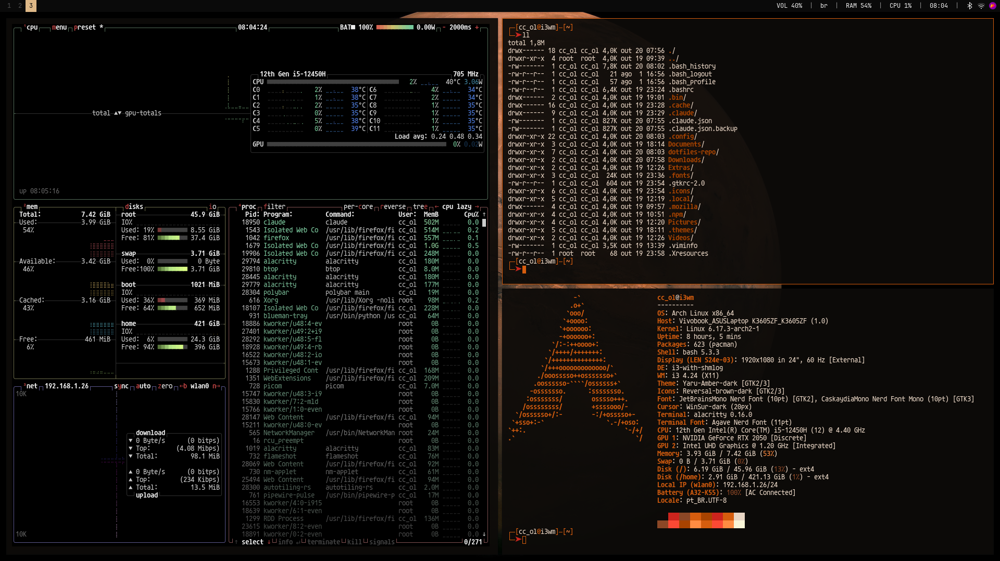

# Dotfiles - Minimalist Mars Theme

A clean and minimalist Linux desktop configuration with a Mars-inspired color scheme (red/orange tones).

## Screenshots

### Clean Desktop


### Terminal + File Manager


### System Monitor


## Preview

- **Window Manager:** i3-gaps
- **Status Bar:** Polybar
- **Compositor:** Picom
- **Color Scheme:** Mars theme (red/orange accents)
- **Font:** JetBrainsMono Nerd Font

## Components

### i3-gaps
Tiling window manager with clean gaps and minimal borders.

**Features:**
- 5 workspaces
- Floating windows for audio controls, file manager, and utilities
- Auto-tiling support via `autotiling-rs`
- Auto-lock after 10 minutes of inactivity
- External HDMI monitor setup

### Polybar
Minimalist status bar with essential information.

**Modules:**
- i3 workspaces
- Audio volume (PulseAudio)
- Keyboard layout
- RAM usage
- CPU usage
- Time (HH:MM)
- System tray

### Picom
Lightweight compositor for transparency and smooth transitions.

**Features:**
- Window shadows
- Fade in/out animations
- Opacity rules for inactive windows
- VSync enabled

### Nitrogen
Wallpaper manager.

### SDDM
Display manager with sddm-astronaut theme.

## Dependencies

### Required
```bash
sudo pacman -S i3-gaps polybar picom nitrogen dunst rofi \
               alacritty thunar firefox flameshot pavucontrol \
               nm-applet blueman xautolock xorg-xrandr
```

### Optional
```bash
# Auto-tiling
yay -S autotiling-rs

# Code editor
yay -S zeditor

# SDDM theme
yay -S sddm-astronaut-theme
```

### Fonts
```bash
sudo pacman -S ttf-jetbrains-mono-nerd
```

## Installation

### 1. Backup existing configurations
```bash
mkdir -p ~/.config/backup
mv ~/.config/i3 ~/.config/backup/i3_backup
mv ~/.config/polybar ~/.config/backup/polybar_backup
mv ~/.config/picom ~/.config/backup/picom_backup
mv ~/.config/nitrogen ~/.config/backup/nitrogen_backup
```

### 2. Clone repository
```bash
git clone <your-repo-url> ~/dotfiles
cd ~/dotfiles
```

### 3. Install configurations
```bash
# Create config directories
mkdir -p ~/.config/{i3,polybar/scripts,picom,nitrogen}

# Copy i3 config
cp i3/config ~/.config/i3/config
cp i3/power-menu.sh ~/.config/i3/power-menu.sh
chmod +x ~/.config/i3/power-menu.sh

# Copy polybar config
cp polybar/config.ini ~/.config/polybar/config.ini
cp polybar/launch.sh ~/.config/polybar/launch.sh
chmod +x ~/.config/polybar/launch.sh

# Copy polybar scripts (optional, not currently used)
cp polybar/scripts/bluetooth.sh ~/.config/polybar/scripts/bluetooth.sh
chmod +x ~/.config/polybar/scripts/bluetooth.sh

# Copy picom config
cp picom/picom.conf ~/.config/picom/picom.conf

# Copy nitrogen config
cp nitrogen/nitrogen.cfg ~/.config/nitrogen/nitrogen.cfg
cp nitrogen/bg-saved.cfg ~/.config/nitrogen/bg-saved.cfg

# SDDM config (requires root)
sudo cp sddm/sddm.conf /etc/sddm.conf
```

### 4. Set wallpaper
Place your wallpaper at:
```bash
~/Pictures/wallpapers/wallhaven-zm387v.jpg
```

Or use nitrogen to select a different wallpaper:
```bash
nitrogen
```

### 5. Reload i3
Press `Mod+Shift+r` or logout and login again.

## Key Bindings

### Applications
- `Mod + Enter` - Terminal (Alacritty)
- `Mod + Space` - App launcher (Rofi)
- `Mod + F` - File manager (Thunar)
- `Mod + Z` - Code editor (Zeditor)
- `Mod + B` - Browser (Firefox)
- `Mod + P` - Audio control (Pavucontrol)
- `Print` - Screenshot (Flameshot)

### Window Management
- `Mod + Arrow Keys` - Navigate windows
- `Mod + Shift + Arrow Keys` - Move windows
- `Mod + V` - Split horizontally
- `Mod + Shift + V` - Split vertically
- `Mod + S` - Stacking layout
- `Mod + W` - Tabbed layout
- `Mod + E` - Toggle split layout
- `Mod + T` / `Mod + Shift + Space` - Toggle floating
- `Mod + Q` - Close window

### Workspaces
- `Mod + 1-5` - Switch to workspace 1-5
- `Mod + Shift + 1-5` - Move window to workspace 1-5

### System
- `Mod + Shift + C` - Reload i3 config
- `Mod + Shift + R` - Restart i3
- `Mod + Shift + X` - Lock screen
- `Mod + Escape` - Power menu (logout/restart/shutdown)

**Note:** `Mod` key is the Super/Windows key

## Monitor Setup

The configuration is set for an external HDMI monitor with the laptop display turned off.

To modify, edit `~/.config/i3/config`:
```bash
# For laptop display only
exec_always --no-startup-id xrandr --output eDP-1 --auto --primary --output HDMI-1 --off

# For dual monitors
exec_always --no-startup-id xrandr --output eDP-1 --auto --output HDMI-1 --auto --right-of eDP-1
```

## Customization

### Colors
Edit color variables in:
- `~/.config/i3/config` (lines 107-112)
- `~/.config/polybar/config.ini` (lines 6-14)

### Autostart
Modify autostart applications in `~/.config/i3/config` (lines 138-174)

### Polybar Modules
Add/remove modules in `~/.config/polybar/config.ini` (line 40)

## Troubleshooting

### Polybar not showing
```bash
# Check if polybar is running
ps aux | grep polybar

# Manually restart
~/.config/polybar/launch.sh
```

### Picom not starting
```bash
# Check picom errors
picom --config ~/.config/picom/picom.conf

# Try different backend
# Edit ~/.config/picom/picom.conf and change backend to "glx"
```

### Wallpaper not loading
```bash
# Manually restore wallpaper
nitrogen --restore

# Or set it again
nitrogen
```

## Credits

- **Theme inspiration:** Mars colony aesthetic
- **Font:** JetBrains (JetBrainsMono Nerd Font)
- **SDDM Theme:** sddm-astronaut

## License

MIT License - Feel free to use and modify as you wish.
