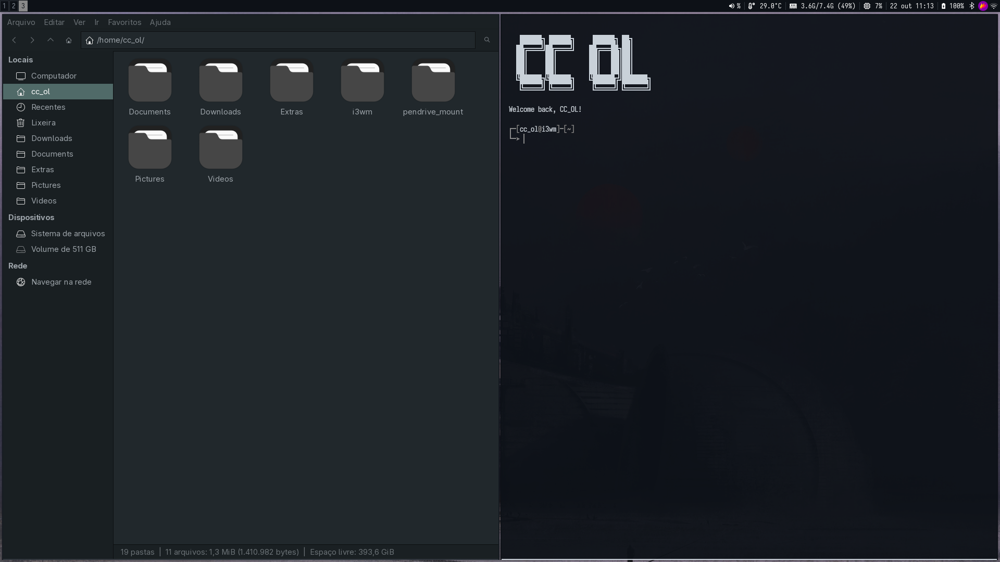
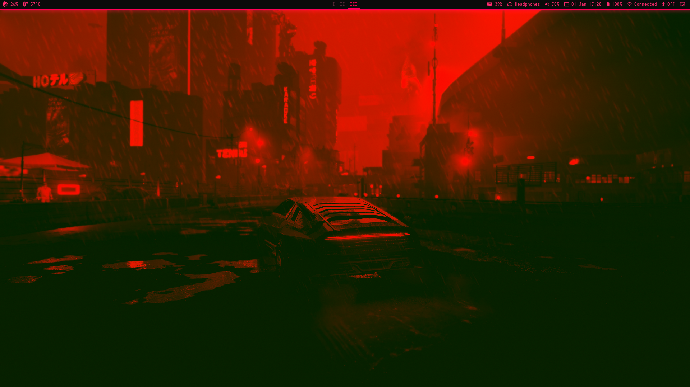
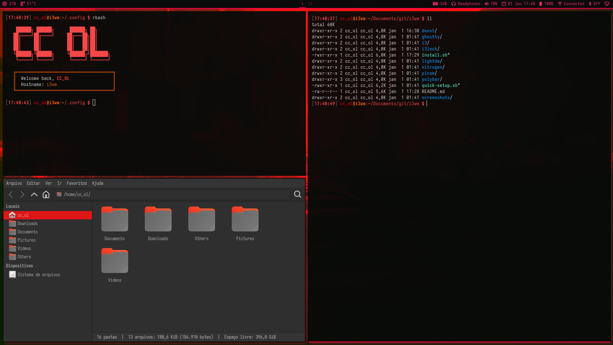

# i3wm Dotfiles - Cyberpunk Red/Neon Theme

Cyberpunk-themed i3wm configuration with red/neon aesthetics and dark background.



## Screenshots






## Features

- **WM:** i3-gaps with red neon borders
- **Bar:** Polybar with cyberpunk theme
- **Compositor:** Picom with red glow shadows
- **Terminal:** Ghostty with optimized colors
- **Launcher:** dmenu + j4-dmenu-desktop
- **Notifications:** Dunst with red/neon theme
- **Lock:** i3lock-color with cyberpunk theme
- **DM:** LightDM + mini-greeter
- **Theme:** Cyberpunk Red/Neon (#ff0055, #ff2a6d, #0a0a0a)
- **Fonts:** Iosevka Nerd Font

## Quick Install

```bash
git clone <your-repo-url> ~/i3wm-dotfiles
cd ~/i3wm-dotfiles
chmod +x quick-setup.sh
./quick-setup.sh
```

This will:
1. Install all required packages (with confirmation)
2. Copy all dotfiles to `~/.config/`
3. Optionally setup LightDM display manager
4. Backup existing configs to `~/.config/backup/`

## Manual Installation

### 1. Install Packages

**Core packages:**
```bash
sudo pacman -S i3-gaps polybar picom dmenu j4-dmenu-desktop \
               nitrogen dunst thunar firefox ghostty \
               flameshot pavucontrol nm-applet blueman \
               xautolock xorg-xrandr ttf-iosevka-nerd \
               ttf-jetbrains-mono-nerd
```

**AUR packages:**
```bash
yay -S i3lock-color lightdm-mini-greeter
```

**Optional:**
```bash
sudo pacman -S code  # VSCode
yay -S autotiling-rs  # Auto-tiling
```

### 2. Install Dotfiles

```bash
chmod +x install.sh
./install.sh
```

### 3. Setup Display Manager (Optional)

```bash
sudo ./lightdm/setup-lightdm.sh
```

### 4. Reload

Press `Mod+Shift+R` or logout and login again.

## Key Bindings

### Applications
| Key | Action |
|-----|--------|
| `Mod+Enter` | Terminal (Ghostty) |
| `Mod+Space` | App launcher (dmenu) |
| `Mod+F` | File manager |
| `Mod+Z` | VSCode |
| `Mod+B` | Browser |
| `Mod+P` | Audio control |
| `Print` | Screenshot |

### Windows
| Key | Action |
|-----|--------|
| `Mod+Arrows` | Navigate |
| `Mod+Shift+Arrows` | Move window |
| `Mod+V` | Split horizontal |
| `Mod+Shift+V` | Split vertical |
| `Mod+T` | Toggle floating |
| `Mod+Q` | Close window |

### Workspaces (Roman Numerals: I-IX)
| Key | Action |
|-----|--------|
| `Mod+1-9` | Switch workspace |
| `Mod+Shift+1-5` | Move to workspace |

### System
| Key | Action |
|-----|--------|
| `Mod+Shift+C` | Reload config |
| `Mod+Shift+R` | Restart i3 |
| `Mod+Shift+X` | Lock screen |
| `Mod+Escape` | Power menu |

## Customization

### Colors (Cyberpunk Red/Neon Theme)

Edit `~/.config/i3/config`:
```
set $bg-color            #0a0a0a
set $inactive-bg-color   #1a0a0f
set $text-color          #ff2a6d
set $accent-color        #ff073a
set $border-color        #330011
set $focused-border      #ff0055
```

Edit `~/.config/polybar/config.ini`:
```ini
[colors]
background = #0a0a0a
foreground = #ff2a6d
primary = #ff0055
alert = #ff0055
```

### dmenu Colors

Edit `~/.config/i3/config` launcher line:
```bash
bindsym $mod+space exec j4-dmenu-desktop --dmenu="dmenu -i -nb '#0a0a0a' -nf '#ff2a6d' -sb '#ff0055' -sf '#0a0a0a' -fn 'Iosevka-11'"
```

### Polybar Modules

Edit modules in `~/.config/polybar/config.ini`:
```ini
modules-left = cpu temperature
modules-center = i3
modules-right = memory pulseaudio date battery
```

### Monitor Setup

Edit `~/.config/i3/config`:
```bash
# Laptop only
exec_always --no-startup-id xrandr --output eDP-1 --auto --primary

# External only (current config)
exec_always --no-startup-id xrandr --output eDP-1 --off --output HDMI-1 --auto --primary

# Dual monitors
exec_always --no-startup-id xrandr --output eDP-1 --auto --output HDMI-1 --auto --right-of eDP-1
```

## Troubleshooting

### Polybar not starting
```bash
# Test polybar
~/.config/polybar/launch.sh

# Check polybar scripts permissions
chmod +x ~/.config/polybar/scripts/*.sh
```

### Fonts not rendering
```bash
fc-cache -fv
fc-list | grep -i iosevka
```

### i3lock not working
```bash
# Test lock script
~/.config/i3lock/lock.sh

# Install i3lock-color
yay -S i3lock-color
```

### LightDM issues
```bash
# Check if enabled
systemctl status lightdm

# Reconfigure
sudo ./lightdm/setup-lightdm.sh
```

## Repository Structure

```
i3wm/
├── i3/                    # i3 config + power menu
├── polybar/               # Polybar config + scripts
├── picom/                 # Compositor config (red glow)
├── dunst/                 # Notification daemon config
├── ghostty/               # Ghostty terminal config
├── i3lock/                # Lock screen script
├── nitrogen/              # Wallpaper manager config
├── lightdm/               # Display manager config
├── screenshots/           # Desktop screenshots
├── quick-setup.sh         # One-command full setup
├── install.sh             # Dotfiles installer
└── README.md
```

## What's Included

- **i3-gaps** with red neon borders (3px) and gaps (6px inner, 2px outer)
- **Polybar** with CPU, temp, memory, audio, battery, updates modules + red underline
- **Picom** with red glow shadows (#ff0055), transparency (95%), and smooth fading
- **dmenu + j4-dmenu-desktop** for minimal app launcher with cyberpunk colors
- **Dunst** notification daemon with red/neon theme
- **i3lock-color** with blur effect, clock display, and cyberpunk red theme
- **LightDM mini-greeter** for minimal login screen
- **Ghostty** as default terminal with optimized readable colors
- **Cyberpunk Red/Neon** color scheme throughout (#ff0055, #ff2a6d, #0a0a0a)

## Credits

- Fonts: Iosevka Nerd Font, JetBrains Mono Nerd Font
- WM: i3-gaps
- Bar: Polybar
- Theme: Cyberpunk Red/Neon (Custom)

## License

MIT - Free to use and modify
