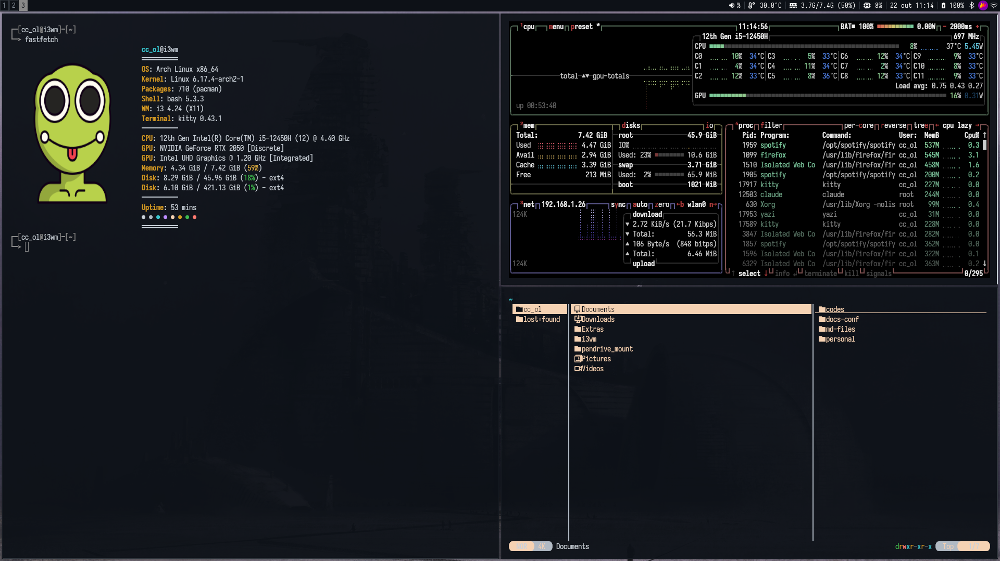
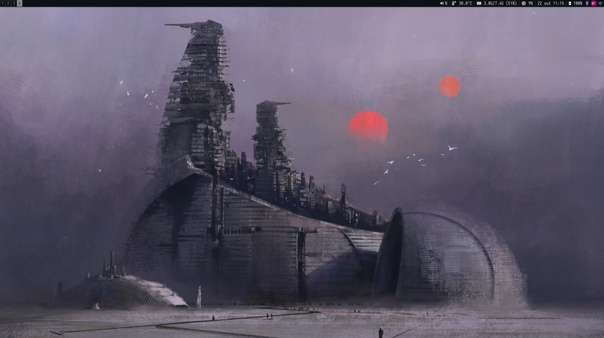

# i3wm Dotfiles - Minimalist Dark Theme

A clean and minimalist i3wm desktop configuration with dark theme and elegant typography.

## Screenshots





## Features

- **Window Manager:** i3-gaps with minimal borders and gaps
- **Status Bar:** i3blocks (lightweight and simple)
- **Compositor:** Picom (transparency, shadows, fade)
- **Terminal:** Kitty
- **App Launcher:** Rofi (minimal dark theme)
- **Screen Lock:** i3lock-color
- **Font:** Iosevka (terminal, rofi, i3bar) + JetBrainsMono Nerd Font (i3lock)
- **Color Scheme:** Dark with white/gray accents

## Dependencies

### Required Packages
```bash
sudo pacman -S i3-gaps i3blocks picom nitrogen dunst rofi \
               kitty thunar firefox flameshot pavucontrol \
               nm-applet blueman xautolock xorg-xrandr \
               i3lock-color
```

### Optional
```bash
# Auto-tiling for smart window splitting
yay -S autotiling-rs

# Code editor
yay -S zed
```

### Fonts
```bash
sudo pacman -S ttf-iosevka-nerd ttf-jetbrains-mono-nerd
```

## Installation

### Quick Install
```bash
git clone <your-repo-url> ~/i3wm-dotfiles
cd ~/i3wm-dotfiles
chmod +x install.sh
./install.sh
```

### Manual Installation

1. **Backup existing configs**
```bash
mkdir -p ~/.config/backup
mv ~/.config/i3 ~/.config/backup/i3_backup
mv ~/.config/i3blocks ~/.config/backup/i3blocks_backup
mv ~/.config/picom ~/.config/backup/picom_backup
mv ~/.config/rofi ~/.config/backup/rofi_backup
mv ~/.config/kitty ~/.config/backup/kitty_backup
mv ~/.config/i3lock ~/.config/backup/i3lock_backup
```

2. **Install configs**
```bash
# i3
cp -r i3 ~/.config/
chmod +x ~/.config/i3/power-menu.sh

# i3blocks
cp -r i3blocks ~/.config/
# You may need to install i3blocks-contrib scripts:
# git clone https://github.com/vivien/i3blocks-contrib ~/.config/i3blocks/scripts

# Picom
cp -r picom ~/.config/

# Rofi
cp -r rofi ~/.config/

# Kitty
cp -r kitty ~/.config/

# i3lock
cp -r i3lock ~/.config/
chmod +x ~/.config/i3lock/lock.sh
```

3. **Set wallpaper**
```bash
# Install nitrogen if not already installed
sudo pacman -S nitrogen

# Set your wallpaper
nitrogen
```

4. **Reload i3**
Press `Mod+Shift+R` or logout and login again.

## Configuration Details

### i3 Config
- **Mod key:** Super/Windows key
- **Gaps:** Inner 3px, Outer 1px
- **Border:** 2px pixel borders
- **Workspaces:** 1-5
- **Monitor:** Configured for external HDMI (disable laptop display)
- **Auto-lock:** 10 minutes of inactivity

### Kitty Terminal
- **Font:** Iosevka Term 11pt
- **Opacity:** 95%
- **Theme:** Dark with custom colors
- **Padding:** 10px

### i3blocks
**Modules (left to right):**
- Volume
- Temperature
- Memory
- CPU
- Time/Date
- Battery

### Picom
- **Shadows:** Enabled
- **Fade:** 0.03 step
- **Opacity:** Inactive windows 85%
- **Backend:** xrender
- **VSync:** Enabled

### Rofi
- **Theme:** Minimalist dark (black background, white text)
- **Font:** Iosevka 10pt
- **Selection:** Dark gray highlight

### i3lock
- **Colors:** Black background, white text
- **Clock:** Enabled with large display
- **Blur:** 8px
- **Fonts:** JetBrainsMono Nerd Font

## Key Bindings

### Applications
| Key | Action |
|-----|--------|
| `Mod + Enter` | Terminal (Kitty) |
| `Mod + Space` | App launcher (Rofi) |
| `Mod + F` | File manager (Thunar) |
| `Mod + Z` | Code editor (Zed) |
| `Mod + B` | Browser (Firefox) |
| `Mod + P` | Audio control (Pavucontrol) |
| `Print` | Screenshot (Flameshot) |

### Window Management
| Key | Action |
|-----|--------|
| `Mod + Arrow Keys` | Navigate windows |
| `Mod + Shift + Arrow Keys` | Move windows |
| `Mod + V` | Split horizontal |
| `Mod + Shift + V` | Split vertical |
| `Mod + S` | Stacking layout |
| `Mod + W` | Tabbed layout |
| `Mod + E` | Toggle split layout |
| `Mod + T` | Toggle floating |
| `Mod + Q` | Close window |

### Workspaces
| Key | Action |
|-----|--------|
| `Mod + 1-5` | Switch to workspace |
| `Mod + Shift + 1-5` | Move container to workspace |

### System
| Key | Action |
|-----|--------|
| `Mod + Shift + C` | Reload i3 config |
| `Mod + Shift + R` | Restart i3 |
| `Mod + Shift + X` | Lock screen |
| `Mod + Escape` | Power menu |

## Floating Windows

These applications open as floating by default:
- Pavucontrol (800x600, centered)
- Flameshot (1200x700, centered)
- Nitrogen (900x600, centered)

## Monitor Setup

The default configuration disables the laptop display and uses only external HDMI.

**To change:**

Edit `~/.config/i3/config`:
```bash
# Laptop display only
exec_always --no-startup-id xrandr --output eDP-1 --auto --primary --output HDMI-1 --off

# Dual monitors (laptop + HDMI)
exec_always --no-startup-id xrandr --output eDP-1 --auto --output HDMI-1 --auto --right-of eDP-1
```

## Customization

### Colors (i3)
Edit color variables in `~/.config/i3/config` (lines 114-122):
```
set $bg-color            #0d1117
set $inactive-bg-color   #161b22
set $text-color          #c9d1d9
set $accent-color        #898989
set $border-color        #30363d
set $focused-border      #c9d1d9
```

### i3blocks Modules
Edit `~/.config/i3blocks/config` to add/remove/modify modules.

Available modules (require i3blocks-contrib):
- Volume
- Temperature
- Memory
- CPU
- Battery
- WiFi/Network
- Time/Date

## Troubleshooting

### i3blocks not showing modules
```bash
# Check if i3blocks-contrib scripts are installed
ls ~/.config/i3blocks/scripts/

# If missing, clone the repo:
git clone https://github.com/vivien/i3blocks-contrib ~/.config/i3blocks/scripts
```

### Picom not starting
```bash
# Test picom with config
picom --config ~/.config/picom/picom.conf

# Try different backend (edit picom.conf)
backend = "glx"  # instead of "xrender"
```

### Wallpaper not loading
```bash
nitrogen --restore
```

### i3lock not working
```bash
# Test i3lock manually
~/.config/i3lock/lock.sh

# Make sure i3lock-color is installed
yay -S i3lock-color
```

### Fonts not rendering correctly
```bash
# Refresh font cache
fc-cache -fv

# Verify fonts are installed
fc-list | grep -i iosevka
fc-list | grep -i jetbrains
```

## Repository Structure

```
i3wm/
├── i3/
│   ├── config              # i3 main configuration
│   └── power-menu.sh       # Power menu script
├── i3blocks/
│   └── config              # i3blocks configuration
├── i3lock/
│   └── lock.sh             # Lock screen script
├── kitty/
│   └── kitty.conf          # Kitty terminal config
├── picom/
│   └── picom.conf          # Compositor config
├── polybar/
│   └── config.ini          # Polybar config (alternative)
├── rofi/
│   └── config.rasi         # Rofi launcher theme
├── screenshots/            # Desktop screenshots
├── install.sh              # Installation script
└── README.md               # This file
```

## Notes

- **Polybar config is included** but not used by default (i3blocks is used instead)
- To switch to Polybar: uncomment line 158 in `~/.config/i3/config` and comment out the i3bar section (lines 160-179)
- i3blocks requires contrib scripts for advanced modules
- Workspace bindings 6-9 are set to workspace 5 (edit if you want more workspaces)

## Credits

- **Fonts:** Iosevka, JetBrains Mono
- **WM:** i3-gaps
- **Bar:** i3blocks
- **Compositor:** Picom
- **Terminal:** Kitty

## License

MIT License - Free to use and modify.
